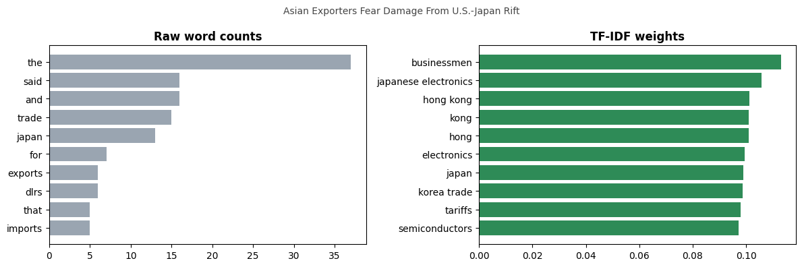
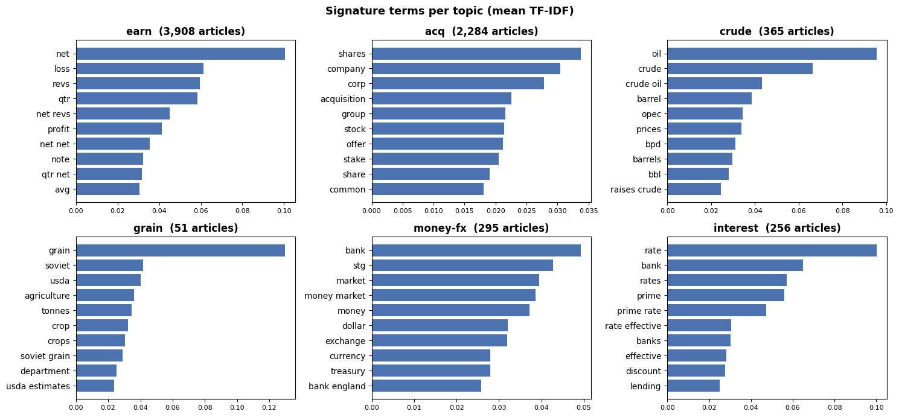
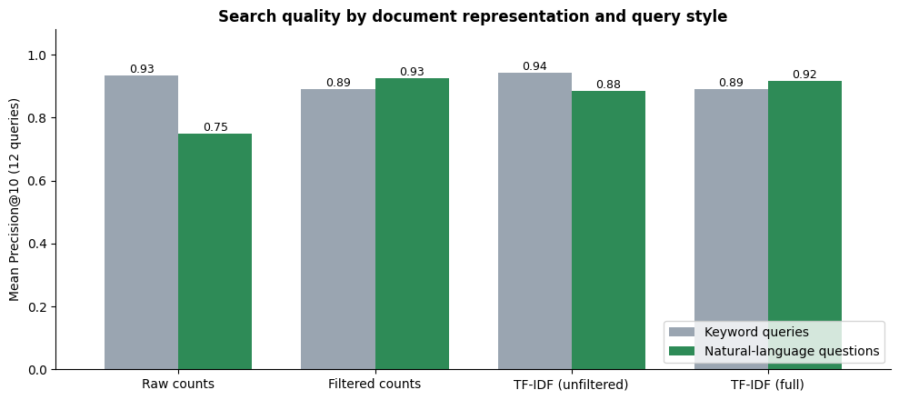
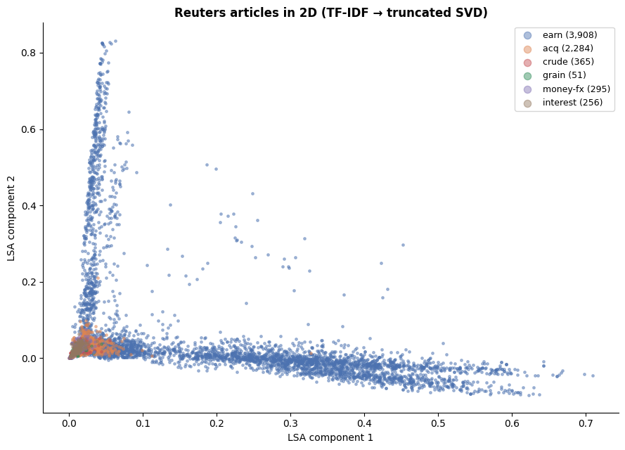

# 🔎 TF-IDF Search Engine & Keyword Extraction

[](https://colab.research.google.com/github/MMujtabaX/tfidf-search-engine/blob/main/tfidf_search_engine.ipynb)


TF-IDF is usually taught as "features for a classifier". This project uses it for what it was originally built for: **information retrieval**. On **10,657 Reuters news articles**, it extracts keywords, summarizes topics, powers a **cosine-similarity search engine** (with a quantitative evaluation), finds similar articles, and maps the whole collection in 2D with latent semantic analysis. A PDF loader lets you run it on your own documents, such as research papers.

<p align="center">
  
</p>
<p align="center"><sub>Raw counts surface filler words; TF-IDF surfaces what the article is actually about.</sub></p>

## 🧭 What's Inside

| # | Section | Highlights |
|---|---------|------------|
| 1 | Loading documents | PDF text extraction with `pypdf` (no Java needed), or the Reuters corpus |
| 2 | TF-IDF matrix | 10,657 × 43,064 sparse matrix with bigrams, sublinear TF and news-specific stopwords |
| 3 | Keyword extraction | Per-article keywords and per-topic signature terms |
| 4 | Search engine | Query → cosine similarity ranking, evaluated with Precision@10 |
| 5 | "More like this" | Document-to-document similarity |
| 6 | Topic map | TF-IDF → truncated SVD (LSA) into 2D |

## 🏷️ Keyword Extraction

**Top keywords per article** (highest TF-IDF weights):

| Article | Keywords |
|---------|----------|
| China Daily Says Vermin Eat 7-12 Pct Grain Stocks | preservation, grain stocks, china daily, waste, storage |
| Australian Foreign Ship Ban Ends But NSW Ports Hit | nsw, ports, ban, cargo handling, disruption |
| Stoltenberg Sees Moves To Strengthen Paris Accord | stoltenberg, poehl, paris accord, louvre agreement |
| Turkey Calls For Dialogue To Solve Dispute | turkey, greece, aegean, continental shelf |

**Topic signatures:** averaging TF-IDF vectors across all articles in a topic gives an unsupervised summary of that topic.

<p align="center">
  
</p>

## 🔎 The Search Engine

A query is treated as a tiny document, vectorized with the same TF-IDF model, and compared to all 10,657 articles with cosine similarity in a single sparse matrix product.

```python
search("opec oil production cut")
```

| Score | Title | Topics |
|-------|-------|--------|
| 0.222 | Egyptian 1986 Crude Oil Output Down On 1985 | crude |
| 0.203 | Saudi Success Seen In Curbing Opec Production | crude |
| 0.197 | Overseas \<OSG\> Sees Opec Quotas Key To Rates | crude, ship |
| 0.183 | Argentine Oil Production Down In January 1987 | crude, nat-gas |
| 0.177 | Opec May Have To Meet To Firm Prices - Analysts | crude |

### Evaluating it

Using Reuters' topic labels as relevance judgments, the evaluation compares four document representations on two query styles. **Keyword queries** look like *"crude oil prices opec"*; **natural-language questions** look like *"what are analysts saying about the price of crude oil"*.

<p align="center">
  
</p>

| Representation | Keyword queries | Natural-language questions |
|----------------|-----------------|----------------------------|
| Raw counts | 0.93 | **0.75** |
| Filtered counts (stopwords) | 0.89 | 0.93 |
| TF-IDF (no stopword list) | **0.94** | 0.88 |
| TF-IDF (full pipeline) | 0.89 | 0.92 |

**Findings:**
- **Keyword queries are easy for every method.** Distinctive words alone find relevant articles.
- **Natural-language questions break raw counts.** Words like *"the"* and *"what"* dominate the similarity.
- **IDF fixes most of this automatically** (0.75 → 0.88) without any hand-made word list. A stopword list fixes it explicitly (0.93).
- Once stopwords are removed, TF-IDF adds little over counts on this benchmark. Filtering also slightly hurts keyword queries, so **every preprocessing choice is a trade-off**.

## 🗺️ A Map of the News

<p align="center">
  
</p>

Compressing 43,000 TF-IDF dimensions to 2 with truncated SVD (LSA) reveals the collection's dominant structure. The two strongest "concepts" are **earnings reports** (*net, revs, loss, qtr, profit*) and **dividend notices** (*qtly div, record, pay*). Reuters publishes thousands of these formulaic financial notices, so they form their own axes, while the other topics sit closer to the origin.

## 📄 Use It on Your Own PDFs

```python
PDF_FOLDER = "/content/papers"   # upload your PDFs here in Colab
```

Set `PDF_FOLDER` and run all cells to get keywords, search and similarity over your own documents, such as a folder of research papers.

## 🚀 Run It

Click the **Open in Colab** badge above and choose **Runtime → Run all**. The Reuters corpus downloads automatically through NLTK, and the full run takes about 1–2 minutes.

```bash
pip install nltk scikit-learn pandas numpy matplotlib pypdf
```

## ⚠️ Limitations

- TF-IDF matches **exact words**: searching "car" won't find "automobile".
- It ignores word order and meaning.
- Topic labels are only a rough proxy for relevance, and 12 queries per set is a small benchmark.

Modern semantic search uses **dense embeddings**, but TF-IDF and **BM25** remain fast, explainable baselines and are still used in hybrid search systems.

## 🙏 Acknowledgements

Started from an NLP course exercise on applying TF-IDF to document collections; rebuilt and extended into a search engine with evaluation, keyword extraction and LSA visualization.

## 👤 Author

**Muhammad Mujtaba Khan Suri** — CS @ UBIT, University of Karachi
[GitHub](https://github.com/MMujtabaX)
